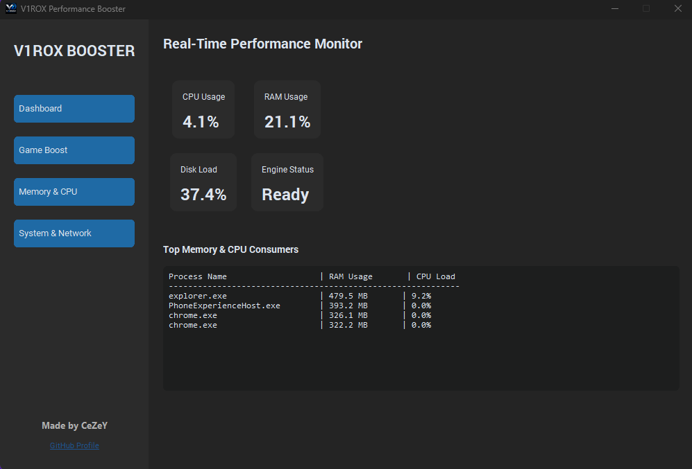
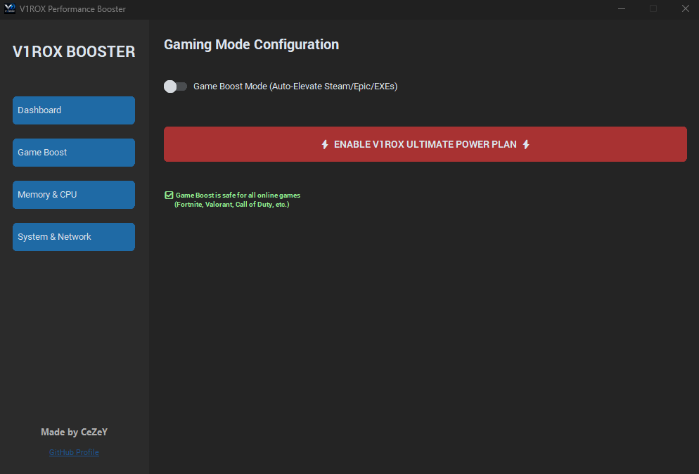
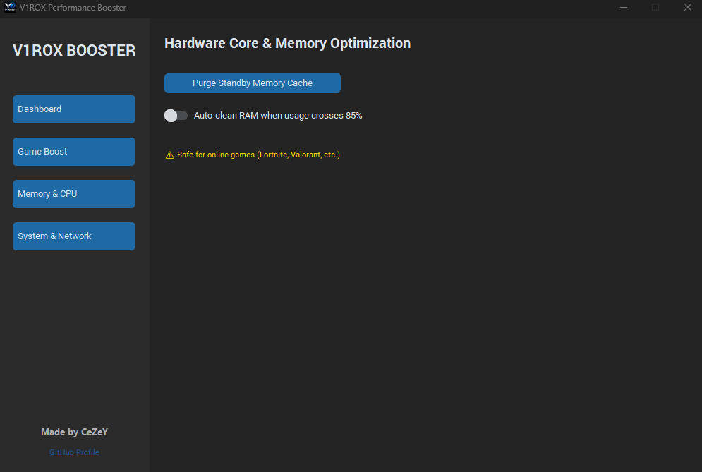
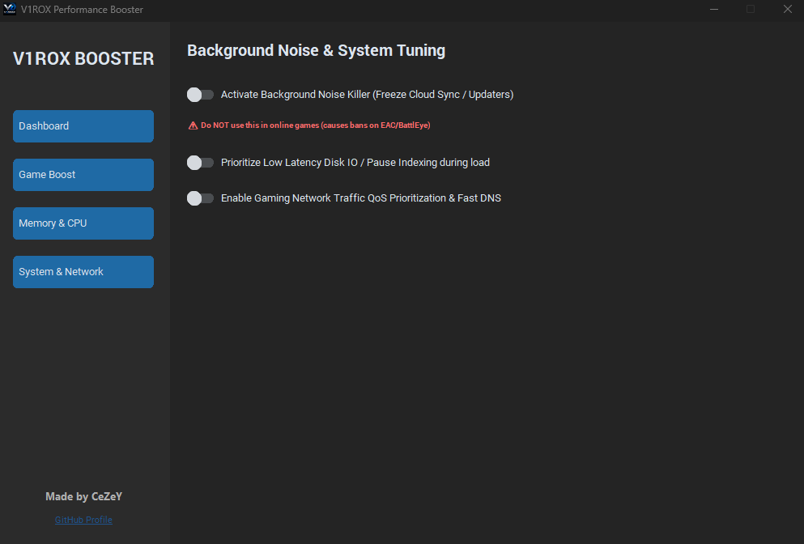

# V1ROX Performance Booster
A python performance booster with many features that improve the overall performance of user's pc.

**(Please read the [SAFETY REPORT](SAFETY_REPORT.md) to know what features you can use in some online games that have anti-cheats)**

## ⚙️Core Features:
- Dashboard (Real-Time Telemetry):
            - Hardware Monitoring: Tracks live CPU, RAM, and Disk usage percentages.
            - System Tray: when you close the tool (by pressing X) it hides on system tray (in the up arrow alongiside your internet and audio icons), if you want to close it completely just right click it and click the quit completely option

  
- Game Boost:
            - Forces the game to use HIGH PRIORITY CLASS so that windows allows the game to be first to process and other background apps to be the last (meaning windows pushing more resources to that game)
            - On modern CPUs with more than 8 cores, it restricts the game's affinity to the primary performance cores (Cores 0-7), preventing game threads from being dumped into slower efficiency cores (does not work in some games and you may get worse performance)
            - Ultra Performance Power Plan (one click button): enables and activates a custom power plan better than the default windows high performance plan.

  
- Memory & CPU:
            - Cached memory purge: does exactly what it says, it purges the memory's cache, exactly what RAMMap does, if you played a long time you will probally (or even when turning on your PC) have more than 5GB cached stored in the memory cache, and your pc starts to be laggy, so this comes in usefull

  
- System & Network:
            - Background "Noise Killer": freezes useless apps (useless means when you play a game you don't need cloud sync, updates to interupt you), it freezes them and keeps them paused as long as you have the game up and the tool as well (usefull for singleplayer games mostly, do not use this option in online games)
            - Prioritize Low Latency Disk IO: This basically changes how windows schedules disk operations, faster loading, less micro-stutters, more stable frame pacing (mostly in open world games)
            - Pause Indexing during load: Usefull more for HDD users and low end ssds (barely noticeable on NVMe M.2 ssds), what it does is temporarily stops or reduces indexing activity while the system is under load (Windows Search Indexing constantly scans for files, updates search database, tracks file changes, so this option basically pause and minimize this so the games load faster)
            - Gaming Network Traffic QoS Prioritization & Fast DNS: sets dns to Cloudfare DNS (which is faster), making some of your packets more stable (even ping/ms).

### 👨‍💻 Credits
* **Developer:** [CeZeY (CazymirTM)](https://github.com/CazymirTM)
* **UI Designer:** AlexXZrZ
* **Memory & CPU code by:** AlexXZrZ
